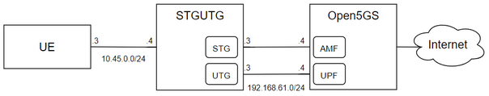

 

# 5G Traffic Connector

5G Traffic Connector is a software created for the generation of both signal and user traffic to be sent to a 5G network core. It is based on implementations from the [Free5GC](https://www.free5gc.org/) project and is distributed under an Apache 2.0 license.

Developed by [UPM RSTI Research group](https://blogs.upm.es/rsti).

## Installation 

### 1. Install dependencies

```
sudo apt-get install libpcap-dev
```

### 2. Build executable

```
go build
```

### 3. Configure and run

```
nano src/config.yaml
```
```
stgutgmain 
```
or
```
stgutgmain -t 
```
for testing mode

---

## Example: Deployment scenario with Free5gc-Compose v3.0.5



This is a network scenario in which we are going to use Free5gc-Compose v3.0.5 and the STGUTG to give Internet access to a virtual machine. The scenario consists of 3 VMs as it is represented in the picture. 

[Free5GC](https://www.free5gc.org/) is an open-source project for 5th generation (5G) mobile core networks, which intends to implement the 5G core network (5GC) defined in 3GPP Release 15 (R15) and beyond. Part of the STGUTG core derives from that project. In this example, we use the NFs implemented in Free5G to deploy a 5G core and then test the STGUTG software.

### 1. Install Free5gc-compose v3.0.5
Free5gc-compose v3.0.5 is a docker-based repository for the NFs implemented by 5G. As a prerequisite, Docker and Docker-compose tools should be installed.

Once the tools are installed, clone the [Free5gc v3.0.5 repository](https://github.com/free5gc/free5gc-compose/releases/tag/v3.0.5) to start adapting the docker-compose.yaml and the NFs configuration files. 
 
### 2. Configure docker-compose.yaml

1. The default declaration of the containers upf1, upf2 and n3iwf and all their mentions on the rest of the file should be erased.

2. In the AMF section this should be added:

```
ports :
  - "48412:38412/sctp"
```
  
3. In the UPF section this should be added:
```
ports :
  - " 2152:2152/ udp "
  - " 2152:2152/ tcp "
command : sh -c "chmod +x upf-iptables.sh && ./upf-iptables.sh && ./free5gc-upfd -f ..config/upfcfg.yaml"
volumes :
  - ./config/upfcfgb.yaml:/free5gc/config/upfcfg.yaml
  - ./config/upf-iptables.sh:/free5gc/free5gc-upfd/upf-iptables.sh
```


4. The script with the following sentences for the iptables of upfb container should be created. It must be saved in the config/ folder of the Free5gc-compose folder.
```
# !/ bin / sh
iptables -t nat -A POSTROUTING -o eth1 -j MASQUERADE
iptables -t nat -A POSTROUTING -o eth0 -j MASQUERADE
IPTABLES -I FORWARD 1 -j ACCEPT
```

5. In the NRF section UPFb is added to the "depends on:" section:
```
  depends_on:
    - db
    - free5gc-upf-b
```
### 2. Configuration of SMF in Free5gc-Compose

Add the UTG IP address (192.168.43.2 in the example), in the gnb1 section:

```
gNB1 : # the name of the node
  type : AN # the type of the node ( AN or UPF )
  an_ip : 192.168.43.2
```

### 3. Add the Network interfaces to the Free5gc VM and the IPtables rules

Add these IPs with ifconfig to the network interfaces created to connect the Free5gc machine with the STGUTG machine (in the example, ens5 and ens4).
```
sudo ifconfig ens4 192.168.43.3 netmask 255.255.255.0 up
```
```
sudo ifconfig ens5 192.168.42.3 netmask 255.255.255.0 up
```
Execute these commands in the terminal to allow the Free5gc-Compose to reach the Internet. (in the example this uses ens6 interface. Make sure to use the propoer one depending on the specific scenario).

```
sudo sysctl -w net . ipv4 . ip_forward =1
```
```
sudo iptables -t nat -A POSTROUTING -o <Interface that reaches internet> -j MASQUERADE
```
```
sudo systemctl stop ufw
```
```
sudo iptables -I FORWARD 1 -j ACCEPT
```
### 4. Configure STGUTG

1. Add the IPs of the figure to the network interfaces (previously created to interconnect both machines). In othe example the addresses are: 
```
sudo ifconfig enp0s9 192.168.43.2 netmask 255.255.255.0 up
```
```
sudo ifconfig enp0s8 192.168.42.2 netmask 255.255.255.0 up
```
```
sudo ifconfig enp0s10 60.60.0.3 netmask 255.255.255.0 up
```
2. Modify the config.yaml file to match the network configuration (the example IP addresses are already written in the config file, so in this case, IP addresses can be matched with the ones shown in the figure).

```
# Network Functions
  amf_ngap: 192.168.42.3
  amf_port: 48412

  upf_gtp: 192.168.43.3
  upf_port: 2152

  gnb_gtp: 192.168.43.2
  gnbg_port: 9487

  gnb_ngap: 192.168.42.2
  gnbn_port: 2152

  ue_ori: 60.60.0.1
```

3. Configure MAC addresses and network interfaces.

- src_iface is the interface of the STGUTG VM that faces the UE VM (enp0s10 in the example).
- dst_iface is the interface of the STGUTG VM that faces the Free5gc VM on the user plane (enp0s9 in the example).
- eth_src is the MAC address of the interface of the STGUTG VM that faces the UE VM (enp0s10 in the example).
- ue_number is the number of UEs to be emulated (it depends on the number of VMs deployed as UEs).

```
 # Interaces and MACs for traffic
  src_iface: "enp0s10"
  dst_iface: "enp0s9"
  eth_src: "fa163e2d99eb"

  # Number of UEs to use in traffic mode
  ue_number: 1
```

### 4. UE VM configuration 

Create an interface to reach the STGUTG VM and make a default route to make all the traffic reach the STGUTG. Set MTU to 1400B.


```
sudo ifconfig enp0s9 192.168.43.2 netmask 255.255.255.0 mtu 1400 up
```
```
sudo ip route add default via 60.60.0.3
```

### 5. Run the scenario

1. In Free5gc VM, execute in the Free5gc-compose folder the following commands. This will start the NFs of the 5G core:

```
sudo docker-compose build
```
```
sudo docker-compose start free5gc-upf-b
```
```
sudo docker-compose up
```

2. subscribe the UE in the core:

In a web browser, access the VM of the Free5gc in the web dashboard (http://<ip of free5gc VM>:5000). 
	- user: admin
	- pass: free5gc.

Add a new subscriber without modifying any parameter.

3.  run the STGUTG software:
```
sudo ./stgutgmain
```

4. Use the UE VM to send traffic through the core to any Internet-based service (ping to 8.8.8.8 should suffice to test if the configuration is successful).

---

## Installation with Docker

An alternative way for the installation of the STGUTG software using docker is provided here. Docker configuration files might be outdated.

1. Download all github stgutg repository.
2. Extract dockerfile and docker-compose files from folder stgutg. This is because Dockerfile needs copy stgutg folder to docker container.

Default path tree (e.g /home/stgutg)
  - src
  - utils
  - Dockerfile
  - README.md
  - config.yaml
  - docker-compose.yml
  - init.sh
  - stg-utg

Path tree for docker (e.g /home)
  - stgutg
  - Dockerfile
  - docker-compose.yml

---

 
